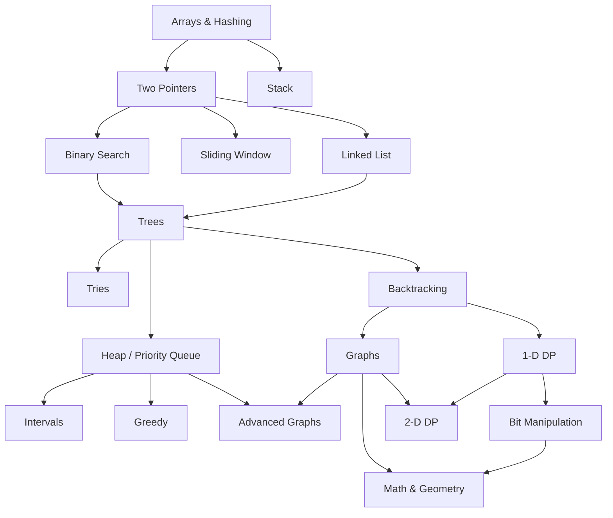

# leetcode-ws

- [https://neetcode.io/roadmap](https://neetcode.io/roadmap)

```mermaid
graph TD;
A[Arrays & Hashing] --> B[Two Pointers];
A --> C[Stack];
B --> D[Binary Search];
B --> E[Sliding Window];
B --> F[Linked List];
D --> G[Trees] --> H[Tries];
F --> G[Trees];
G --> J[Heap / Priority Queue];
G --> I[Backtracking];
J --> K[Intervals];
J --> L[Greedy];
J --> N[Advanced Graphs];
I --> M[Graphs];
M --> N[Advanced Graphs];
M --> O[Math & Geometry];
M --> Q[2-D DP];
I --> P[1-D DP];
P --> Q[2-D DP];
P --> R[Bit Manipulation];
R --> O[Math & Geometry];
```
